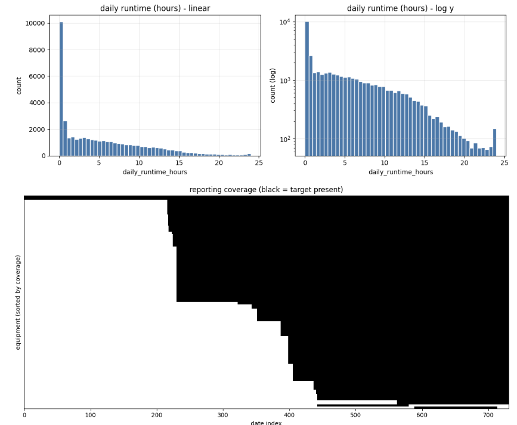
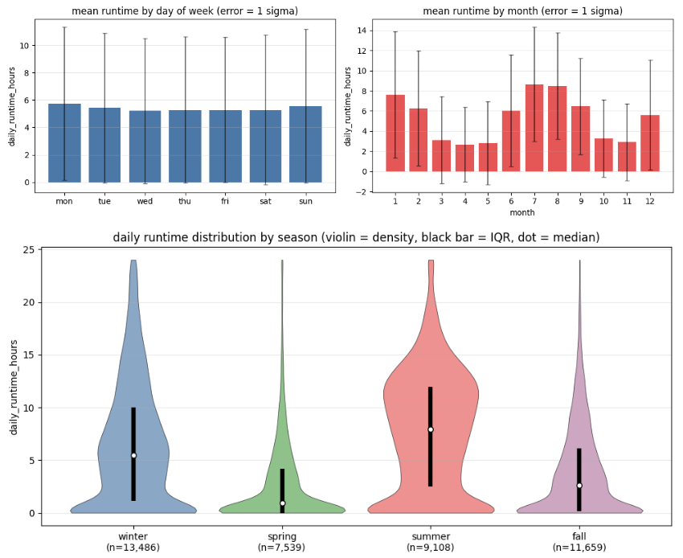
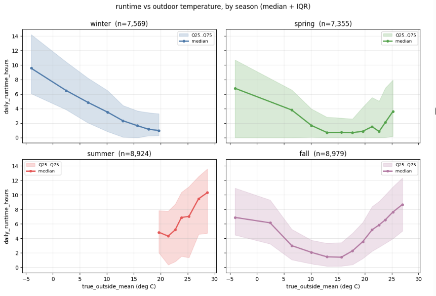
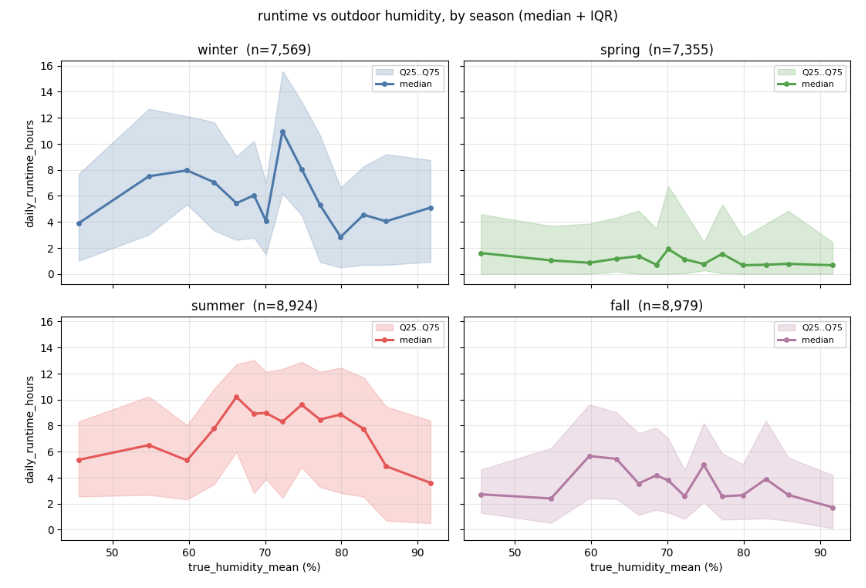
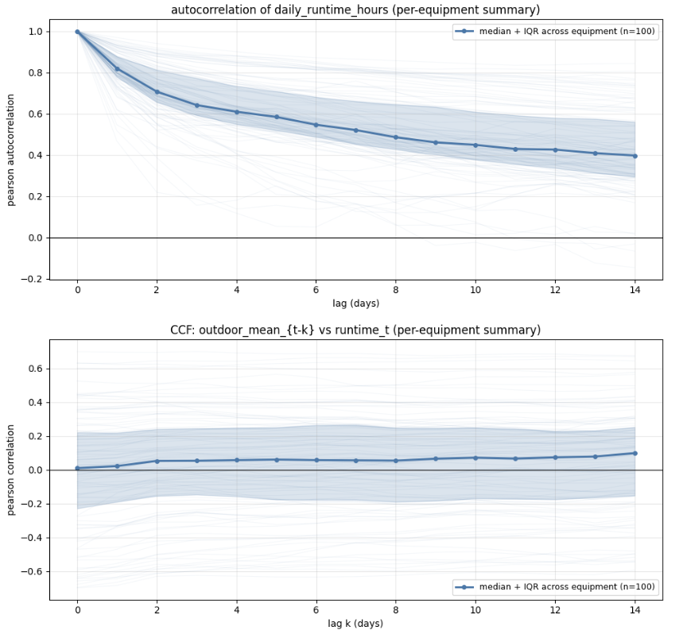
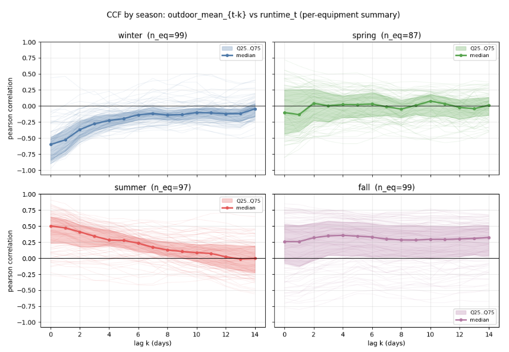

# Final Model Report: Predictive Analysis of HVAC Compressor Runtime

## 1. Analytical Method & Evolution

The objective of this project was to predict daily HVAC compressor runtime (bounded 0, 24 hours) across a heterogeneous fleet of 100 residential thermostats. The analytical approach underwent a rigorous three-stage evolution, moving from local linear baselines to a global gradient-boosted framework capable of capturing complex seasonal and behavioral patterns.

Initially, the project utilized Local Rolling Window Baselines. These models employed Lasso Regression (L1 regularization) with an optimal alpha of 0.45. They were trained locally on a house-by-house basis using a 28-day training window to predict the 29th day, shifting forward iteratively. While this established a baseline, the linear models struggled to consistently outperform a simple naive persistence model (predicting today based on yesterday), primarily due to their inability to capture non-linear interactions between indoor comfort and outdoor weather.

The Intermediate Stage transitioned to a global training paradigm using XGBoost. This phase evaluated four distinct strategies: Pooled (one global model), Local (per-house), Seasonal (per-calendar season), and Clustered (behavioral grouping via K-Means). The results from this stage proved that Seasonal Training outperformed all other groupings, confirming that climatic shifts are the primary driver of system behavior variance. Validation in this stage used a strict 80/20 chronological split and a 5-fold expanding window time-series cross-validation.

The Final Stage culminated in a Stratified Blocked Global Framework using LightGBM and CatBoost. This model replaced chronological splits with a Stratified Blocked Time Series Split (14-day blocks) to ensure balanced exposure to all meteorological seasons while strictly preventing temporal leakage. Furthermore, the final implementation includes a local per-house model benchmark, allowing for a direct performance comparison between the global ensemble and specialized local models.

## 2. Solution Description: Processing Pipeline

To maintain data integrity across all 100 devices, a unified processing pipeline was implemented. This pipeline resolves the issues of irregular pings, device blackouts, and midnight-boundary overlaps that plagued earlier iterations.

**ASCII Pipeline Flow Chart:**

    [Raw Manufacturer CSVs] + [Outdoor Weather CSV]
              |
              v
    [standardize_indoor_columns] ---------> Standardization of column names
              |
              v
    [resolve_same_timestamp_bursts] ------> Group by TS, F-Fill, keep last ping
              |
              v
    [normalize_running_mode] -------------> Map states to {heat, cool, off, unknown}
              |
              v
    [inject_virtual_expiration_rows] -----> IF gap > 30min: Insert "unknown" row
              |                             at gap_start + 30min to kill persistence
              |
              v
    [bounded_time_interpolate] -----------> Linear interpolation of temp/humidity
              |                             (Strict 30-min validity threshold)
              |
              v
    [aggregate_to_daily] -----------------> Midnight-slicing of event intervals;
              |                             Time-weighted stats (Mean, Std, Skew)
              |
              v
    [local_grid] -------------------------> Reindex to continuous calendar to
              |                             prevent leakage during lag generation
              v
    [Final Feature Matrix]

This architecture's most critical innovation is the Virtual Expiration Logic. By injecting synthetic rows during blackouts (defined by a strict 30-minute time threshold), the model is prevented from "hallucinating" a running state during periods when a device is offline. This logic includes a specific numeric reset for the setpoint, acting as a crucial "kill-switch" to terminate forward-fill persistence and prevent stale targets from influencing post-blackout predictions. Additionally, the midnight-slicing ensures that runtime is accounted for in the correct calendar day, even for intervals spanning across 00:00:00.

Comprehensive feature engineering further enhances this pipeline by computing Bessel-corrected weighted variance and weighted skewness/kurtosis, providing the model visibility into thermal environment volatility rather than just simple central tendencies.

This diagnostic suite visualizes the operational density and environmental drivers of the HVAC fleet across meteorological seasons. The violin plot captures the heavy-tailed nature of the runtime data, revealing that while Spring and Fall exhibit high concentrations of idle equipment (near zero runtime), Summer features a consistent, daily cooling bulge, and Winter is characterized by a long tail of extreme, intermittent heating peaks extending to 24 hours.

Faceted relationship plots further decompose these operational modes against outdoor weather metrics. In the Runtime vs. Outdoor Temperature panel, we observe the "opposing thermal loads": Winter and Fall show a strong negative correlation (lower temperatures drive heating), while Summer displays a steep positive correlation (higher temperatures drive cooling). Meanwhile, the Runtime vs. Outdoor Humidity panel isolates humidity as a secondary thermal driver, most notably in the Summer, where increased latent load forces higher median runtimes for dehumidification even when sensible temperatures remain moderate.

## 3. Data & Validation Methodology

The dataset consists of 100 raw indoor thermostat files and one consolidated outdoor weather file.

### 3.1 Global Modeling vs. Local Benchmarking

While the final global models (LightGBM/CatBoost) were trained on the unified dataset to maximize generalizability, the project utilized specific inclusion criteria for evaluating local performance. In the Per-House Evaluation phase, houses were only scored if they possessed a minimum viable sample size of 40 training rows and 10 test rows. This ensured that the local benchmark metrics remained statistically reliable when compared against the global "stratified blocked" performance, avoiding skew from houses with insufficient historical reporting.

### 3.2 Stratified Blocked Time Series Split

To preserve chronological integrity while ensuring seasonal representation, we implemented a 14-day Blocked Split:

* The timeline is divided into contiguous 14-day blocks.
* Each block is assigned to a meteorological season based on its midpoint month.
* **Test Set:** The latest 20% of blocks within each season.
* **Validation Set:** The latest 15% of the remaining blocks (non-test), used exclusively for early stopping to ensure the test set remains truly "unseen."

**Data Distribution Table:**

| Split | Block Count | Row Count | Percentage |
| --- | --- | --- | --- |
| Training | 35 | 15,771 | ~38% |
| Validation | 8 | 10,688 | ~26% |
| Testing | 10 | 15,333 | ~36% |

**$$INSERT PLOT: Data Coverage / Reporting Heatmap$$**

The Reporting Heatmap displays the temporal density of pings for all 100 equipment IDs. The visualization justifies the use of the Continuous Calendar Grid (local_grid), as it exposes significant gaps in reporting that would otherwise lead to incorrect lag generation if treated as a sparse series.

## 4. Features & Mutual Information

The feature set evolved from 26 variables (20 eligible for lagging) in the baseline to a comprehensive 146-feature set (6 same-day exogenous and 140 historical lags).

### 4.1 Feature Categories

| Category | Features |
| --- | --- |
| Daily Runtime/States | daily_heating_hours, daily_cooling_hours, daily_off_hours, daily_unknown_hours, daily_runtime_hours, daily_fan_on_hours, fan_runtime_ratio. |
| Thermostat Behavior | setpoint_change_count, occupied_ping_count, unoccupied_ping_count. |
| Statistical Distributions | Individually calculated for indoor temp, setpoint, outdoor temp, and outdoor humidity (min, max, median, iqr, skewness, variance, moments). |

**Target Lags:** An optimal 10-day lag window was selected after a comprehensive sweep from 1 to 21 days. Critically, the outdoor temperature trend gradient is recomputed dynamically for every window during the sweep, ensuring the weather trend matches the historical memory window currently under evaluation.

**Environmental Context:** Includes true_outside_mean and the aforementioned recomputed trend gradient.

### 4.2 Feature Ranking

Mutual Information (MI) scoring was used to select the base features. The scores presented below are derived from the final preprocessing script audit. Crucially, current-day endogenous variables (like indoor temperature) were excluded to prevent temporal leakage.

**Full Top 25 Base Features (By Mutual Information):**

| Rank | Feature | Score | Rank | Feature | Score |
| --- | --- | --- | --- | --- | --- |
| 1 | daily_off_hours | 3.1026 | 14 | outdoor_temp_q25 | 0.1986 |
| 2 | daily_heating_hours | 3.0796 | 15 | outdoor_temp_median | 0.1910 |
| 3 | daily_cooling_hours | 2.2163 | 16 | outdoor_temp_q75 | 0.1866 |
| 4 | temp_gradient_mean | 0.2483 | 17 | outdoor_temp_raw_moment_2 | 0.1745 |
| 5 | setpoint_gap_mean | 0.2404 | 18 | month | 0.1178 |
| 6 | true_outside_mean | 0.2198 | 19 | outdoor_temp_trend_gradient | 0.1150 |
| 7 | outdoor_temp_min | 0.2148 | 20 | true_humidity_mean | 0.1069 |
| 8 | true_outside_min | 0.2131 | 21 | setpoint_raw_moment_2 | 0.1029 |
| 9 | outdoor_temp_raw_moment_3 | 0.2073 | 22 | setpoint_mean | 0.1025 |
| 10 | outdoor_temp_mean | 0.2049 | 23 | setpoint_raw_moment_3 | 0.1008 |
| 11 | outdoor_temp_time_weighted_mean | 0.2049 | 24 | setpoint_time_weighted_mean | 0.0989 |
| 12 | true_outside_max | 0.2014 | 25 | daily_unknown_hours | 0.0955 |
| 13 | outdoor_temp_max | 0.2012 | | | |

This suite of diagnostics evaluates temporal memory and how lagging weather conditions impact current-day equipment runtime. The Autocorrelation Function (ACF) of daily runtime demonstrates a slow, steady decay over a 14-day period rather than a sharp drop-off, confirming strong state persistence where historical behavior is highly predictive of current states.

The Seasonal Cross-Correlation (CCF) analysis reveals the necessity of our seasonal stratification. While pooled data appears misleadingly flat due to operational signal cancellation, the seasonal breakdown exposes that Winter operations exhibit a negative correlation with temperature while Summer operations exhibit a strong positive correlation. Finally, the Panel Structure Validation compares per-equipment medians against date-pooled means; the distinct divergence of these curves validates that cross-correlation must be calculated individually on each equipment's timeline to respect the unique behavioral structure of the panel dataset.

## 5. Results & Comparative Performance

The transition from linear models to gradient-boosted ensembles resulted in a significant uplift across all metrics. CatBoost was integrated specifically for its use of symmetric trees and ordered boosting to reduce prediction shift, providing a robust architectural alternative to the leaf-wise growth of LightGBM.

### 5.1 Global Model vs. Baselines

The final LightGBM model achieved an R^2 of 0.7705, representing a 32.8% improvement over the average baseline Lasso performance.

**Top 5 LightGBM Gain Features ("Black Box" Logic):**

| Rank | Feature | Information Gain |
| --- | --- | --- |
| 1 | daily_runtime_hours_lag_1 | 21,551,452.9 |
| 2 | daily_runtime_hours_lag_2 | 3,361,982.5 |
| 3 | daily_off_hours_lag_1 | 986,498.3 |
| 4 | true_outside_mean | 760,938.6 |
| 5 | daily_runtime_hours_lag_3 | 465,033.9 |

**Comparative Performance Summary:**

| Model Stage | Strategy | R^2 | RMSE (hrs) | MAE (hrs) |
| --- | --- | --- | --- | --- |
| Baseline | Local Lasso (28-day window) | 0.580 (Avg) | -- | 1.9200 |
| Intermediate | XGBoost Global Seasonal | 0.7050 | 2.9110 | 2.0470 |
| Final (LGBM) | Global Stratified Blocked | 0.7705 | 2.7372 | 1.9024 |

### 5.2 Diagnostic Evaluation

While the model performs excellently overall, a deep dive into the "Worst Quartile" reveals that the remaining error is concentrated in houses with extreme behavioral variance. Winter performance achieved R^2 = 0.7206, RMSE = 3.1902 hours, while summer performance reached R^2 = 0.7258, RMSE = 2.7857 hours, demonstrating robust seasonal generalization.

**$$INSERT PLOT: Predicted vs. Actual Runtime (Binned)$$**

The Binned Predicted vs. Actual plot demonstrates the calibration of the LightGBM model. The narrow IQR band along the 45-degree diagonal indicates that the model is unbiased for the majority of use cases, with variance only increasing during extreme peak-demand days.

**$$INSERT PLOT: Residual Distribution Histogram$$**

The Residual Histogram shows a tight, normal distribution centered at zero. The "fat tails" of the distribution represent the Q4 cohort of erratic-usage households, indicating that the model's primary limitation is now unobserved behavioral data rather than algorithmic capacity.

### 5.3 Benchmarks

The naive persistence benchmark (predict yesterday) serves as the project floor. Data verified from the script logs indicate:

* **Naive Persistence (Predict Yesterday):** MAE = 1.90 hours, RMSE = 3.0567 hours
* **Naive Train Mean:** RMSE = 5.9038 hours
* **Final Model Lift:** The LightGBM model provides a 10.4% improvement in RMSE over simple persistence, proving that multi-day lags and weather gradients provide substantial predictive value beyond simple temporal autocorrelation.
