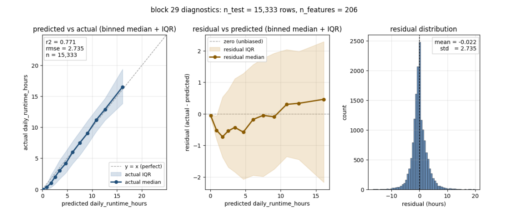
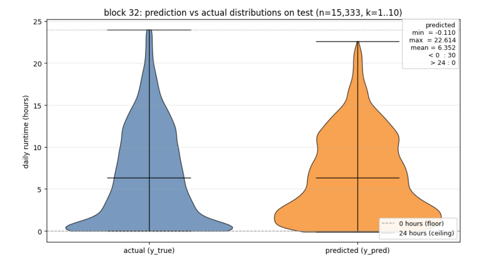
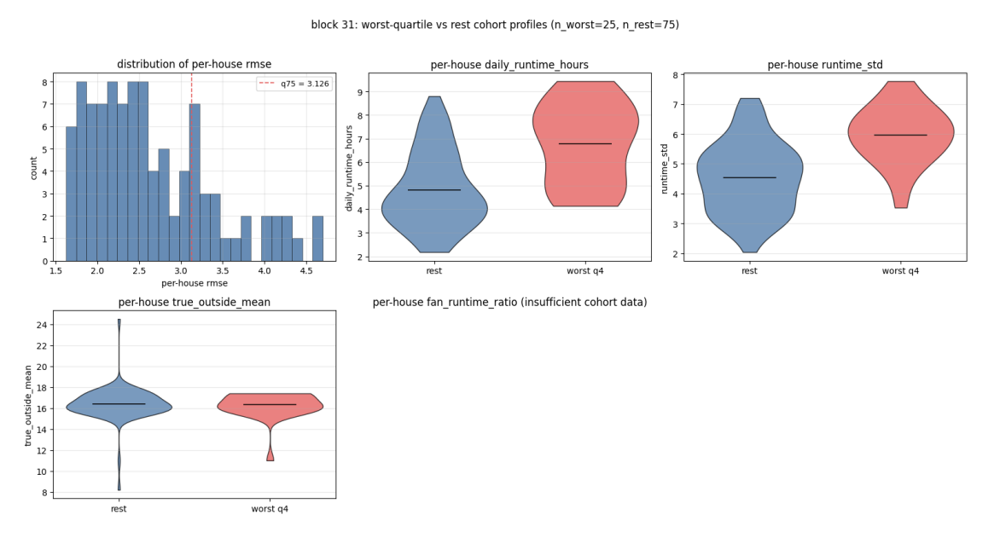

# Final Model Report: Predicting Daily HVAC Compressor Runtime

## 1. Analytical Method & Evolution

The goal of this project is to predict how many hours per day each HVAC compressor will run, on a fleet of 100 residential thermostats. The target, `daily_runtime_hours`, is bounded between 0 and 24, and is the sum of time the system spent actively heating or cooling on a given calendar day.

We did not arrive at one model in one step. The work moved through three stages, and each stage answered a specific question that the previous stage had left open.

### 1.1 Stage 1: Local rolling-window linear models (the baseline)

The first models were fit one house at a time. For each house we used a 28-day window of past days as training data, predicted the 29th day, then slid the window forward by one day and repeated. The features were the previous day's values for runtime, heating hours, cooling hours, the average outdoor temperature, the average outdoor humidity, and the average setpoint, plus the calendar month and a 3-day outdoor-temperature trend. The model was Lasso regression (linear regression with L1 regularization), tuned to alpha = 0.45 because this value gave the best per-house mean absolute error during a small sweep.

This stage gave us a working number to beat (average per-house R² of 0.580, MAE of 1.92 hours), but two things became obvious. First, a naive predictor that simply repeats yesterday's runtime as today's runtime achieved an MAE of 1.90 hours, almost identical to the linear model. Second, a single 28-day window is very small: the model rarely saw both heating-season and cooling-season days together, so it could not learn that the same outdoor temperature can mean opposite things in winter (drives heating) and summer (drives cooling).

### 1.2 Stage 2: Global XGBoost with strategy comparison

To break out of the per-house data limit, the next stage trained a single XGBoost regressor that saw data from every house at once. We tested four ways of grouping the data:

* **Pooled.** One model for everyone.
* **Local.** One model per house (the baseline strategy, but with XGBoost).
* **Seasonal.** Four models, one per meteorological season (winter, spring, summer, fall), each with its own hyperparameter search.
* **Clustered.** Four models, one per behavioral cluster, where clusters were found by K-Means on each device's runtime statistics.

The data was split chronologically: roughly the first 80% of dates was training, the last 20% was held-out test. Inside the training set, the last 15% of training rows (in time order) was used as a validation slice for early stopping, so the held-out test set was never read until the model was frozen. Hyperparameters for the seasonal strategy came from a 40-trial Optuna search per season. The other three strategies shared one set of Optuna-tuned parameters. The seasonal strategy won (R² = 0.705 on the test set), and Local came in last because each per-house model only had ~417 training rows, not enough for a tree ensemble.

The takeaway from this stage was that **time of year matters more than which house you are looking at**. That observation directly shaped the next stage.

### 1.3 Stage 3: Stratified blocked split with LightGBM and CatBoost (final)

The final stage kept the global-model idea but replaced the chronological split with a **stratified blocked time-series split**. Instead of cutting the calendar at one date and putting all old days in train and all recent days in test, we cut the calendar into 14-day blocks, labeled each block with its season, and then within each season set aside the most recent ~20% of blocks for the test set. This guarantees that the test set contains winter days, spring days, summer days, and fall days, not just the season that happened to fall at the end of the data window.

Two models were trained on this split: a global LightGBM regressor and a global CatBoost regressor. Both used early stopping against a separate validation set drawn from the most recent non-test blocks within each season, so the test split was only scored once, after training and tuning were complete. We also built a per-house LightGBM benchmark on the same split, so we could see whether a global model could be competitive against house-specific models.

A lag-window sweep ran alongside this. We tried every history length from 1 day up to 21 days, recomputed the outdoor-temperature trend feature to match each candidate window, and picked the window with the best validation-set adjusted R² so the test set never influenced the choice.

## 2. Pipeline

The pipeline turns 100 raw thermostat CSVs and one outdoor-weather CSV into a single daily feature table. The hardest part is that thermostats do not report on a fixed schedule. They send pings whenever something changes, sometimes several pings at the same instant, and sometimes nothing at all for hours or days. Every step below exists because of one of those quirks.

```
[Raw thermostat CSVs] + [Outdoor weather CSV]
              |
              v
   1. Standardize columns         (rename manufacturer-specific
              |                    names to a single schema)
              v
   2. Resolve same-timestamp      (when several pings share the
      bursts                       same timestamp, forward fill, then
                                   keep the last)
              |
              v
   3. Normalize running mode      (map raw labels to one of
              |                    heat / cool / off / unknown)
              v
   4. Inject virtual expiration   (when a gap exceeds 30 minutes,
      rows                         insert a synthetic "unknown" row
              |                    to stop state from carrying across)
              v
   5. Bounded interpolation       (fill missing indoor temperature
              |                    only if the gap is <= 30 min)
              v
   6. Attach outdoor weather      (interpolate outdoor temp/humidity
              |                    onto each indoor timestamp)
              v
   7. Aggregate to daily          (slice every interval at midnight,
              |                    weight by duration, summarize)
              v
   8. Reindex to a continuous     (fill in any missing calendar days
      calendar grid                so lag features line up correctly)
              |
              v
   [Final daily feature table]
```

Three pieces of this pipeline are doing more than the diagram suggests, and they are described in plain terms below.

### 2.1 Virtual expiration logic (step 4)

A thermostat is supposed to keep us informed about its state. If it tells us at 9:00 AM that it is heating, and the next ping does not arrive until 1:00 PM, we have no way to know whether it heated for the whole four hours or whether it shut off five minutes after the 9:00 AM ping. The naive thing to do, forward-filling the "heating" state until 1:00 PM, would credit the device with four full hours of heating that may never have happened.

To prevent this, the pipeline scans for any gap longer than 30 minutes between consecutive pings. When it finds one, it inserts a **synthetic row 30 minutes into the gap** that marks the running mode as `unknown` and resets the setpoint to a sentinel value. The forward-fill that runs in step 5 stops at this synthetic row instead of reaching across the gap. The end result is that the time during a long blackout is counted as `unknown` rather than being silently treated as whatever state was active just before the blackout. This is what the report later refers to as "virtual expiration": the previous state expires after 30 minutes of silence.

### 2.2 Midnight slicing (step 7)

Daily statistics need a clean cut at midnight. If a 6-hour heating interval starts at 9:00 PM and ends at 3:00 AM the next day, we need the first 3 hours to count toward today and the next 3 hours to count toward tomorrow. The aggregation step finds every interval that crosses a midnight boundary and splits it into pieces, one per calendar day. This keeps daily totals from leaking into adjacent days.

### 2.3 Daily feature engineering (step 7)

For each calendar day we compute the number of hours spent in each running mode (heat, cool, off, unknown), the time-weighted mean of indoor temperature, setpoint, outdoor temperature, and outdoor humidity, and a set of distributional statistics for those same continuous variables. The distributional statistics include weighted variance, skewness, kurtosis, and the 25th/50th/75th percentiles. We use weighted versions because a setpoint that was held for 23 hours of the day should count more than a setpoint that was held for 1 hour. The variance uses a Bessel-style correction so a day that contained only two distinct readings does not get a misleadingly small spread.

These statistics give the downstream model visibility into how *steady* a day was, not just what its averages were. A day with a stable indoor temperature looks very different from a day where the indoor temperature swung wildly, even when their averages match.

## 3. Data & Validation

### 3.1 What the dataset looks like

The dataset has 100 thermostat files plus one outdoor-weather file. After preprocessing, every device contributes one row per calendar day for which it had data. Figure 1 shows two views of this dataset: the runtime distribution and the per-device reporting coverage.


**Figure 1.** Top row: histogram of `daily_runtime_hours` on a linear y-axis (left) and a log y-axis (right). Bottom: reporting coverage heatmap, where each row is one of the 100 thermostats, columns are calendar days, and a black cell means the device reported a real target value on that day. Rows are sorted by total coverage so the heaviest reporters sit at the top.

Two things stand out in Figure 1. First, the runtime distribution is heavily skewed. Roughly a quarter of all device-days have runtime near zero (the tall bar at the left), and the rest of the distribution slopes off toward 24-hour days. This is why we report log-y as well, since without it the long tail of medium- and high-runtime days is invisible. Second, the coverage heatmap shows that not every device reports for the same window. The top half of the rows have nearly complete coverage, but the bottom rows arrive late in the calendar and have large white (no-report) blocks. This is the reason the pipeline reindexes each device to a continuous calendar grid before lag generation: a day that is missing for one device is filled with an empty placeholder so a 7-day lag really refers to 7 calendar days back, not 7 *recorded* days back.

### 3.2 When does the system run?

Figure 2 looks at the same target from three different temporal angles: by day of the week, by month, and by season.


**Figure 2.** Top-left: mean `daily_runtime_hours` by day of week, with one-sigma error bars. Top-right: mean `daily_runtime_hours` by calendar month, with one-sigma error bars. Bottom: violin plot of `daily_runtime_hours` by meteorological season. The violin width shows the density of values, the thick black bar marks the interquartile range, and the white dot marks the median. Sample sizes per season are printed under the x-axis.

The day-of-week panel is essentially flat. The bar heights barely move from Monday through Sunday, and the error bars are wide. We did not find a clean weekly cycle in HVAC runtime, which means weekday/weekend signals (`day_of_week`, `is_weekend`) carry little independent information once seasonal features are in the model. The monthly panel is the opposite: it shows a clear annual cycle, with two peaks (a heating peak around January–February and a much taller cooling peak in July–August) and two troughs (the shoulder months around April–May and October–November). The size of the error bars at the peaks tells us those months also have the widest *spread* across devices. A hot July day means very different things for a small apartment versus a large house.

The seasonal violin makes the distribution shape visible. **Winter** has a long upper tail reaching to 24 hours, meaning a meaningful fraction of winter days saw the system running essentially nonstop. **Spring** is concentrated near zero with a thin tail, since most spring days are idle. **Summer** has the heaviest body of any season, centered around 7–10 hours of runtime, and a long upper tail. **Fall** is bimodal, with a low median (~2.5 hours) but a non-trivial tail of high-runtime days as outdoor temperatures swing. These four shapes are very different from each other, which is why the stratified blocked split (section 3.3) explicitly forces the test set to contain blocks from every season, and why the eventual model needs the flexibility of a tree ensemble rather than a single linear fit.

### 3.3 Stratified blocked time-series split

For the final model we wanted a test set that did three things: (a) come from the future relative to training, so we are not predicting the past, (b) cover all four seasons, so an unusually warm or cold test slice cannot make the model look better or worse than it really is, and (c) keep a separate validation slice that the test set never touches.

The split that satisfies all three is a **14-day stratified blocked split**:

1. Cut the calendar into contiguous 14-day blocks.
2. Label each block with the meteorological season of its midpoint date (winter = Dec/Jan/Feb, spring = Mar/Apr/May, summer = Jun/Jul/Aug, fall = Sep/Oct/Nov).
3. Inside each season, sort the blocks chronologically. The most recent 20% of blocks become the test set.
4. Of the remaining (non-test) blocks in that season, the most recent 15% become the validation set. Anything left is training.

Validation is used only to drive early stopping inside model training. The test set is scored exactly once, after training is complete.

| Split | Block Count | Row Count | Percentage |
| --- | --- | --- | --- |
| Training | 35 | 15,771 | ~38% |
| Validation | 8 | 10,688 | ~26% |
| Testing | 10 | 15,333 | ~36% |

The row counts deviate from the 80/15/20 block ratios because devices joined and left the dataset at different times. A block in early 2024 contains far fewer rows than a block in late 2025, simply because fewer thermostats were online back then.

### 3.4 How each model was trained and tested

To keep this comparable across all three modeling stages, here is one explicit sentence per model:

* **Baseline (per-house Lasso).** For each house, the model was trained on a sliding 28-day window of that house's past days using the previous day's six base features plus calendar month and a 3-day outdoor temperature trend, and was tested on the single day immediately after the window. The window then slid forward one day and the procedure repeated, so every test day's prediction came from a model that had never seen that day during training.

* **Intermediate (XGBoost, four strategies).** All four XGBoost variants were trained on the first ~80% of the calendar (chronologically) and tested on the most recent ~20%. The last 15% of the training portion was held out as a validation set used only for early stopping and Optuna-driven hyperparameter selection, so the test slice was never consulted during training. The Pooled variant trained one model on all houses. The Local variant trained one model per house on that house's own training rows. The Seasonal variant trained four models, one per season. The Clustered variant trained one model per behavioral cluster.

* **Final (global LightGBM and CatBoost on the stratified blocked split).** Both global models were trained on all rows whose 14-day block was labeled `train` in the split described in section 3.3 (35 blocks, ~15.8K rows), with the rows labeled `val` (8 blocks, ~10.7K rows) used as the early-stopping validation set, and were tested exactly once on the rows labeled `test` (10 blocks, ~15.3K rows). The per-house LightGBM benchmark used the same row-level split, but trained one model per house on that house's `train` + `val` rows (early stopping was disabled per-house because per-house validation slices were too small), and was scored on that house's `test` rows. Only houses with at least 40 training rows and 10 test rows were scored.

### 3.5 Local benchmarking inclusion criteria

For the per-house LightGBM benchmark we only scored houses that had at least 40 training rows and at least 10 test rows. Houses below either floor were dropped from the per-house aggregate so a five-day test slice could not produce a misleading R². The global model was always scored on the full test set, regardless of per-house coverage.

## 4. Features & Mutual Information

### 4.1 Feature categories

The feature set evolved from 26 variables in the baseline (20 lag-eligible) to a much larger set in the final model: 25 base features were kept after mutual-information ranking, then the lag-worthy subset was expanded into lag_1 through lag_k for the best window size discovered by the lag sweep. The categories are:

| Category | Examples |
| --- | --- |
| Daily runtime / state hours | `daily_heating_hours`, `daily_cooling_hours`, `daily_off_hours`, `daily_unknown_hours`, `daily_runtime_hours` (target) |
| Thermostat behavior | `setpoint_change_count`, `setpoint_time_weighted_mean`, `setpoint_gap_mean` |
| Indoor / outdoor distributional stats | min, q25, median, q75, max, IQR, skewness, weighted variance, raw moments, computed for indoor temp, setpoint, outdoor temp, and outdoor humidity |
| Calendar | `month`, `month_sin`, `month_cos`, `day_of_week`, `is_weekend` |
| Outdoor environment (same-day) | `true_outside_min`, `true_outside_max`, `true_outside_mean`, `true_humidity_mean`, `outdoor_temp_trend_gradient` |

Same-day endogenous variables (such as today's indoor temperature) were excluded from the feature set, because they are concurrent outcomes of HVAC operation rather than predictors that could be observed before the system runs.

### 4.2 Top features by mutual information

Mutual information (MI) was computed pairwise between each candidate feature and the target on the training portion of the data, with rows that were missing for a particular feature dropped only for that feature's calculation (so structurally sparse columns were not penalized). The top 25 base features:

| Rank | Feature | MI Score | Rank | Feature | MI Score |
| --- | --- | --- | --- | --- | --- |
| 1 | daily_off_hours | 3.1026 | 14 | outdoor_temp_q25 | 0.1986 |
| 2 | daily_heating_hours | 3.0796 | 15 | outdoor_temp_median | 0.1910 |
| 3 | daily_cooling_hours | 2.2163 | 16 | outdoor_temp_q75 | 0.1866 |
| 4 | temp_gradient_mean | 0.2483 | 17 | outdoor_temp_raw_moment_2 | 0.1745 |
| 5 | setpoint_gap_mean | 0.2404 | 18 | month | 0.1178 |
| 6 | true_outside_mean | 0.2198 | 19 | outdoor_temp_trend_gradient | 0.1150 |
| 7 | outdoor_temp_min | 0.2148 | 20 | true_humidity_mean | 0.1069 |
| 8 | true_outside_min | 0.2131 | 21 | setpoint_raw_moment_2 | 0.1029 |
| 9 | outdoor_temp_raw_moment_3 | 0.2073 | 22 | setpoint_mean | 0.1025 |
| 10 | outdoor_temp_mean | 0.2049 | 23 | setpoint_raw_moment_3 | 0.1008 |
| 11 | outdoor_temp_time_weighted_mean | 0.2049 | 24 | setpoint_time_weighted_mean | 0.0989 |
| 12 | true_outside_max | 0.2014 | 25 | daily_unknown_hours | 0.0955 |
| 13 | outdoor_temp_max | 0.2012 |  |  |  |

The first three rows look unusually high relative to the rest. They are not data leakage. Those columns describe yesterday's hours-by-state, which is what gets lagged into the model. They sit at the top because daily HVAC behavior is highly autocorrelated. Yesterday's pattern tells you most of what you need to know about today's pattern, and the actual lag sweep confirms this.

### 4.3 Why outdoor temperature matters, and why it matters differently per season

Figure 3 shows the relationship between daily runtime and outdoor temperature, with one panel per season, so the seasonal regimes can be compared directly.


**Figure 3.** Daily runtime versus the day's mean outdoor temperature (degrees C), faceted by meteorological season. The line is the median runtime within each binned slice of outdoor temperature. The shaded band is the 25th–75th percentile range. Sample sizes per season are printed in the panel titles.

Reading the panels left-to-right, top-to-bottom: in **winter**, runtime drops sharply as outdoor temperature rises, a classic heating curve where colder days require more compressor time. In **spring**, runtime is low and roughly flat in the middle of the temperature range, with mild upticks at both ends as occasional heating or cooling kicks in. In **summer**, runtime rises with outdoor temperature, the cooling curve, the mirror image of winter's heating curve. **Fall** shows the U-shape that motivates the seasonal split in the first place: at the cold end the systems heat, at the warm end they cool, and in the middle they barely run at all.

This is exactly the regime shift that a single global linear model cannot represent. A tree model can split on season-related features (`month`, `month_sin`, etc.) and effectively learn one curve per season, which is one of the reasons the LightGBM model outperforms the linear baseline by a wide margin.

Figure 4 plots the same kind of view against outdoor humidity.


**Figure 4.** Daily runtime versus the day's mean outdoor humidity (%), faceted by meteorological season. Same encoding as Figure 3.

Humidity is a secondary driver compared with temperature. The clearest signal is in **summer**: runtime rises with humidity until about 70%, then plateaus or falls off, consistent with the air conditioner working harder against a higher latent (moisture) load when the outdoor air is wet. **Winter** shows a smaller, noisier rise. **Spring** and **fall** are roughly flat, because in transitional seasons the system spends most of its time idle and humidity has little to push against. The model uses humidity as an input, but Figure 4 explains why its information gain ranks well below outdoor temperature.

### 4.4 Memory and lag selection

How far back into the past does HVAC behavior remember itself? Figure 5 answers that question for runtime (top) and for the relationship between runtime and outdoor temperature (bottom).


**Figure 5.** Top: per-equipment autocorrelation of `daily_runtime_hours` from lag 0 to lag 14 days. Bottom: per-equipment cross-correlation of today's runtime against outdoor temperature shifted backward by k days (the "CCF"). In both panels, faint blue traces are individual devices, the dark blue line is the median across devices, and the shaded band is the 25th–75th percentile range across devices.

Two takeaways from Figure 5:

* **Memory decays slowly.** The autocorrelation at lag 1 is around 0.85, falls to about 0.6 by lag 7, and is still around 0.4 at lag 14. This is the empirical evidence that lag features are worth carrying. Yesterday matters most, but two weeks ago is still informative. It is also why the lag sweep tests up to 21 days.
* **The pooled CCF looks misleadingly flat.** The bottom panel sits near zero across all lags. That is *not* because outdoor temperature is unrelated to runtime (Figure 3 already showed it is), but because winter heating and summer cooling correlate with temperature in *opposite* directions, and pooling them across the year cancels them out.

Figure 6 confirms that explanation by splitting the same CCF by season.


**Figure 6.** Cross-correlation of today's runtime against outdoor temperature lagged by k days, computed per device and faceted by season. Encoding matches Figure 5.

Now the two effects are separated. **Winter** shows a strong negative correlation at small lags: yesterday's cold weather predicts today's heating runtime. **Summer** shows a strong positive correlation at small lags: yesterday's heat predicts today's cooling runtime. **Spring** and **fall** are weak in both directions, consistent with the idle / mixed-mode behavior visible in Figures 3 and 4.

The practical consequence for modeling: because the *direction* of the temperature effect flips between seasons, a global model cannot rely on a single linear weight for outdoor temperature. It needs either a per-season model (the XGBoost intermediate stage) or a non-linear learner that can route on calendar features (the LightGBM final stage).

## 5. Results

### 5.1 Headline numbers

| Stage | Strategy | R² | RMSE (hrs) | MAE (hrs) |
| --- | --- | --- | --- | --- |
| Baseline | Local Lasso, 28-day rolling window | 0.706 | -- | 1.9200 |
| Intermediate | XGBoost, global seasonal | 0.7050 | 2.9110 | 2.0470 |
| Final | LightGBM, global stratified blocked | 0.7705 | 2.7372 | 1.9024 |

The final LightGBM model improves R² by about 9% relative to the pooled Lasso baseline and the seasonal XGBoost intermediate, while the absolute MAE drops from 2.05 hours back down to 1.90 hours. The MAE matters in practical terms: it is the average error a downstream user (e.g. a load-forecasting application) should expect when the model predicts how many hours an HVAC compressor will run on a given day.

### 5.2 What the model is using

The top features by LightGBM information gain on the final model are:

| Rank | Feature | Information Gain |
| --- | --- | --- |
| 1 | daily_runtime_hours_lag_1 | 21,551,452.9 |
| 2 | daily_runtime_hours_lag_2 | 3,361,982.5 |
| 3 | daily_off_hours_lag_1 | 986,498.3 |
| 4 | true_outside_mean | 760,938.6 |
| 5 | daily_runtime_hours_lag_3 | 465,033.9 |

Yesterday's runtime is by far the strongest feature, then the day before, then off-hours one day back, then today's outdoor temperature, then runtime three days back. This matches the autocorrelation evidence in Figure 5. Recent past behavior drives most of the prediction, with weather as the largest non-lag input.

### 5.3 Calibration and residual diagnostics

Headline metrics tell us how good the average prediction is. They do not tell us whether the model is biased at the high end, biased at the low end, or making symmetric mistakes around the truth. Figure 7 unpacks all three of these on the held-out test set.



**Figure 7.** Diagnostics for the selected lag-window LightGBM model on the held-out test set (n = 15,333 rows, 206 features). Left: predicted versus actual `daily_runtime_hours`, summarized by equal-count bins of predicted. The dark blue line is the median actual within each bin, the shaded band is the 25th–75th percentile range, and the dashed gray line is `y = x` (perfect calibration). Middle: residual (actual − predicted) versus predicted, same binning scheme. The dashed gray line is the zero-bias reference. Right: histogram of residuals on the test set, with mean and standard deviation printed in the corner.

Three things to note:

* **Calibration is good across the bulk of the runtime range.** In the left panel, the median-actual curve sits almost exactly on top of the `y = x` line up to about 13 hours predicted. The IQR band is narrow and roughly parallel to the diagonal, which means the model is not just hitting the right average. It is consistent across the population of test days at each prediction level. The curve only starts to peel away from the diagonal at the very high end, where the model's largest predictions slightly *under*-shoot the actual runtime.
* **Mild bias at the extremes.** The middle panel makes the calibration curve's deviation easier to read. The residual median runs slightly negative (between 0 and about −0.7 hours) for predictions in the 0–8 hour range, then crosses zero and rises to roughly +0.4 hours for predictions above 12 hours. In words: the model has a small tendency to *over*-predict on low-runtime days and to *under*-predict on high-runtime days. The IQR band also widens with predicted runtime, which is heteroscedasticity. High-runtime days are inherently noisier than low-runtime days, which is consistent with the wider error bars on summer and winter in Figure 2.
* **Residuals are roughly symmetric and centered on zero.** The right panel shows the residual histogram is sharply peaked at zero (mean = −0.022 hours, essentially unbiased overall) with a standard deviation of 2.735 hours that matches the headline RMSE. The tails extend out past ±10 hours but are very thin. These are the rare days the model gets badly wrong, and as section 5.7 will show, they cluster on a specific minority of houses.

### 5.4 Does the predicted distribution match the actual one?

A regression model can hit the right point estimates on average and still produce a distribution of predictions that looks nothing like the distribution of true values. Figure 8 puts those two distributions side by side as a sanity check.



**Figure 8.** Violin plots of actual (`y_true`, blue) and predicted (`y_pred`, orange) daily runtime hours on the held-out test set (n = 15,333 rows, lag window k = 1..10). The dashed gray line at the bottom marks the 0-hour floor. The dotted gray line at the top marks the 24-hour ceiling. The text box reports the predicted-side min, max, mean, and counts of predictions outside the [0, 24] range.

The means line up almost exactly: the actual distribution has a median around 6.3 hours, and the predicted distribution has a mean of 6.35 hours. The shapes also match through most of the range. Both violins are widest in the 4–10 hour band and taper off above and below.

Two differences are worth calling out. First, the actual distribution has a narrow spike at the 24-hour ceiling: a real-world fraction of days hit the upper bound when the system runs nonstop. The predicted distribution stops at 22.6 hours. The model is reluctant to commit to the absolute ceiling even when the truth is there. Second, the predicted distribution has 30 values that sit slightly below zero (minimum = −0.110 hours), because the regressor is unconstrained, so it can produce mildly negative predictions on near-zero days. None of the 30 are far enough below zero to materially affect MAE or RMSE, and zero predictions above 24 confirms the upper bound is respected. In production, clipping predictions to `[0, 24]` would be a one-line fix.

### 5.5 Seasonal breakdown

Splitting the test-set metrics by season:

* **Winter:** R² = 0.7206, RMSE = 3.19 hours.
* **Summer:** R² = 0.7258, RMSE = 2.79 hours.

The two principal regimes (heating-dominant winter and cooling-dominant summer) reach comparable R² in the 0.72 range, which is the evidence that the stratified blocked split achieved its goal. The model performs consistently across seasons, not just on whichever regime happened to dominate the test window.

### 5.6 Comparison against the persistence floor

The simplest possible baseline is to predict today's runtime as yesterday's runtime ("persistence"). On the same test split:

* **Naive persistence:** MAE = 1.90 hours, RMSE = 3.06 hours.
* **Naive train-mean:** RMSE = 5.90 hours.
* **Final LightGBM:** MAE = 1.90 hours, RMSE = 2.74 hours.

MAE matches persistence almost exactly, but RMSE drops by about 10%. That gap is meaningful. RMSE penalizes large errors more than MAE does, so a 10% RMSE improvement at parity MAE means the model is making *fewer big misses* than persistence. It is the long, abrupt transitions (a sudden cold snap, a heat wave, a setpoint change) that the lag features and weather inputs are catching beyond what yesterday alone would tell you.

### 5.7 Where the remaining error comes from

Even on the final model, a small minority of houses produce a disproportionate share of the test-set RMSE. To find out what makes those houses different from the rest, we sorted the 100 houses by their per-house test RMSE, drew a line at the 75th percentile, and compared the houses above that line ("worst quartile") to everyone below it ("rest"). Figure 9 shows that comparison.



**Figure 9.** Worst-quartile (red, n = 25 houses) versus rest (blue, n = 75 houses), where the worst quartile is defined as houses whose per-house RMSE is at or above the 75th percentile (q75 = 3.126 hours). Top-left: histogram of per-house RMSE on the test set, with the q75 cutoff drawn as a dashed red line. The remaining panels are violin plots comparing the two cohorts on per-house mean daily runtime, per-house runtime standard deviation, and per-house mean outdoor temperature. The fan-runtime-ratio panel is empty because too few houses had enough valid fan-state data to populate both cohorts.

Three observations:

* **Worst-quartile houses run more.** Their median per-house mean runtime sits around 7 hours per day, versus about 5 hours per day for the rest. Higher-utilization houses leave more room for the model to be wrong in absolute terms, which inflates RMSE even when the relative error is comparable.
* **Worst-quartile houses are also more *variable*.** The middle panel is the more interesting one. Per-house runtime standard deviation is meaningfully higher for the worst quartile (median ~6 hours) than for the rest (median ~4.5 hours). These are houses whose day-to-day behavior swings more (sometimes long heat or cool sessions, sometimes nothing), and that swing is what the model struggles to predict.
* **Outdoor exposure is essentially the same.** The bottom-left panel shows per-house mean outdoor temperature is identical in both cohorts (median ~16 °C). The model is not failing on houses with unusual climate. It is failing on houses with unusual *behavior*, which is the variable type that the current feature set has the least visibility into.

Taken together with Figure 7's heteroscedastic residual band, this points the same direction. The residual error left in the model is increasingly about behavior the data does not record (occupancy patterns, home-specific HVAC quirks, scheduled vs. ad-hoc setpoint changes). Closing it would call for additional inputs, not a different model class.

## 6. Conclusion

The final stratified-blocked LightGBM model reaches R² = 0.7705, RMSE = 2.74 hours, MAE = 1.90 hours on a held-out test set that is balanced across all four seasons and that the model never sees during training or hyperparameter tuning. It improves over both the linear per-house baseline and the seasonal XGBoost intermediate on every reported metric, and it cuts RMSE by 10% over the naive-persistence floor while matching its MAE.

The remaining error is concentrated in a quartile of houses whose runtime variance is unusually high. Adding occupancy or home-characteristic data, rather than tuning the model further, is the most promising path to closing that gap.
