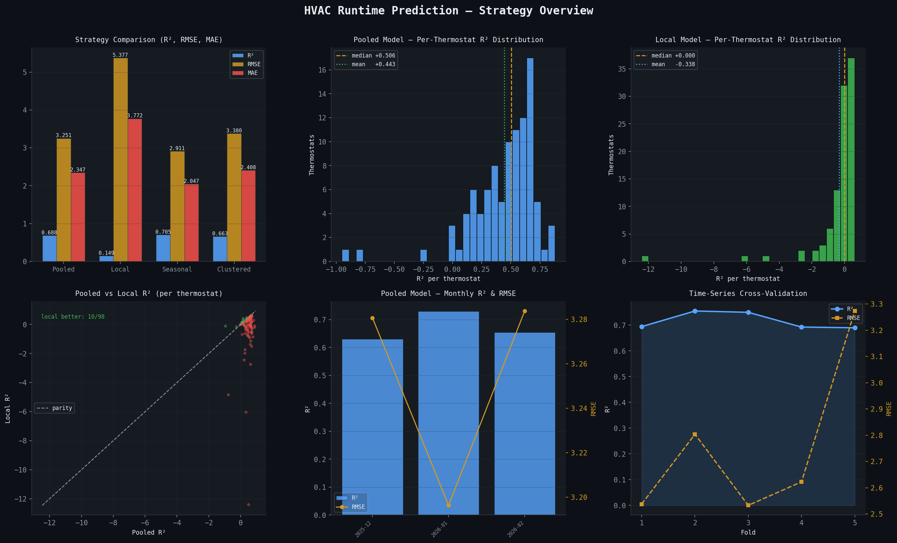
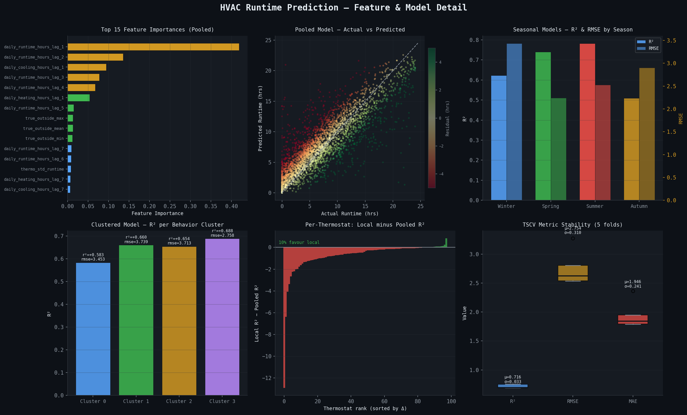

# Model Report: XGBoost HVAC Daily Runtime Prediction

_A report detailing the second XGBoost experiment for predicting HVAC compressor runtime per day, comparing four training strategies across 100 thermostats._

---

## Analytic Approach

**Target Definition**

The target variable is `daily_runtime_hours` — the total number of hours per day that the HVAC compressor is actively running. Values are aggregated from sub-hourly thermostat state records and clipped to the valid range of [0, 24] hours. This is a continuous regression target.

**Inputs**

Features fall into five categories:

| Category              | Features                                                                                                            |
| --------------------- | ------------------------------------------------------------------------------------------------------------------- |
| Runtime lags          | `daily_runtime_hours` lag 1–7 and lag 14; `daily_heating_hours` and `daily_cooling_hours` lags at 1 and 7 days      |
| Indoor thermal state  | `indoor_temp_time_weighted_mean`, `setpoint_time_weighted_mean`, `setpoint_gap_mean`, `indoor_temp_std` — all lag 1 |
| Outdoor weather       | `true_outside_min`, `true_outside_max`, `true_outside_mean`, `true_humidity_mean`, `outdoor_temp_trend_gradient`    |
| Calendar              | `day_of_week`, `is_weekend`, `month_sin`, `month_cos`                                                               |
| Device baseline stats | `thermo_mean_runtime`, `thermo_std_runtime` (computed from training fold only, no leakage)                          |

**Model Type**

Four distinct training strategies were evaluated, all using XGBoost (`reg:squarederror`) as the base learner:

1. **Pooled** — one global model trained across all thermostats simultaneously.
2. **Local** — one independent model per thermostat.
3. **Seasonal** — separate models per calendar season (Winter, Spring, Summer, Fall), each with an independent 40-trial Optuna hyperparameter search on an internal 80/20 time split within that season's data.
4. **Clustered** — thermostats grouped into four behavioral clusters via K-Means on per-device runtime statistics, with one model per cluster.

The Pooled model serves as the primary baseline. The Seasonal strategy emerged as the best-performing approach.

---

## Model Description

**Data Pipeline**

```
Raw thermostat CSVs (Kaggle: lsobieski/raw-thermostat-data)
        │
        ▼
load_data()              — parse timestamps, filter to thermostats with ≥ 90 days
        │
        ▼
add_lag_features()       — fill date gaps per device, compute lags 1–14 for 7 columns
        │
        ▼
add_thermostat_stats()   — merge per-device mean/std runtime from training fold only
        │
        ▼
Chronological 80/20 split (cutoff: 2025-12-05)
        │
        ▼
Strategy-specific training (pooled / local / seasonal / clustered)
        │
        ▼
Predictions clipped to [0, ∞)
```

Only thermostats with 90+ days of data were included (all 100 passed). Lag features extend to 14 days to capture two-week usage patterns. Thermostat-level statistics are always computed from the training portion of each fold to prevent leakage.

**Learner**

`xgboost.XGBRegressor` with objective `reg:squarederror`. Early stopping uses a held-out 15% slice of the training set (last 15% chronologically) rather than the test set, making the stopping criterion genuinely out-of-sample.

**Hyperparameters**

Base parameters (Optuna-tuned, used for Pooled, Local, and Clustered strategies):

| Parameter               | Value  | Notes                                               |
| ----------------------- | ------ | --------------------------------------------------- |
| `n_estimators`          | 1,182  | Upper bound; early stopping typically halts earlier |
| `learning_rate`         | 0.0105 | Low rate for stability                              |
| `max_depth`             | 9      | Allows interaction capture                          |
| `subsample`             | 0.747  | Row-level bagging                                   |
| `colsample_bytree`      | 0.464  | Feature-level bagging                               |
| `min_child_weight`      | 50     | Prevents splits on sparse leaf nodes                |
| `gamma`                 | 4.501  | Minimum loss reduction to split                     |
| `reg_alpha`             | 1.998  | L1 regularization                                   |
| `reg_lambda`            | 4.794  | L2 regularization                                   |
| `early_stopping_rounds` | 20     | Halts if no improvement in val RMSE for 20 rounds   |
| `random_state`          | 42     | Reproducibility                                     |

Seasonal models received an additional independent 40-trial Optuna search per season. The winning configurations varied significantly across seasons (see Results section).

---

## Results (Model Performance)

**Dataset Overview**

| Property          | Value                                  |
| ----------------- | -------------------------------------- |
| Source            | Kaggle: lsobieski/raw-thermostat-data  |
| Thermostats       | 100 (all with ≥ 90 days)               |
| Total rows        | 41,792 daily records                   |
| Date range        | 2024-02-28 → 2026-02-27                |
| Train/test cutoff | 2025-12-05 (80/20 chronological split) |
| Train rows        | 33,494 (2024-02-28 → 2025-12-05)       |
| Test rows         | 8,298 (2025-12-06 → 2026-02-27)        |

**Time-Series Cross-Validation (5 folds)**

CV was performed using 5 expanding-window time-based folds before strategy comparison. Each fold trains on all data strictly before the test window. Thermostat-level statistics are recomputed from each training fold independently to prevent leakage.

| Fold           | Train Rows | Test Rows | R²                | RMSE              | MAE               |
| -------------- | ---------- | --------- | ----------------- | ----------------- | ----------------- |
| 1              | 6,915      | 5,546     | +0.694            | 2.538             | 1.787             |
| 2              | 13,835     | 7,081     | +0.755            | 2.804             | 1.949             |
| 3              | 20,819     | 7,070     | +0.750            | 2.533             | 1.840             |
| 4              | 27,851     | 7,029     | +0.693            | 2.623             | 1.795             |
| 5              | 34,781     | 7,011     | +0.690            | 3.273             | 2.362             |
| **Mean ± Std** |            |           | **0.716 ± 0.033** | **2.754 ± 0.310** | **1.946 ± 0.241** |

**Stability Check**

R² range across folds (max − min) indicates model stability:

- < 0.05 → stable, single-split estimate is reliable
- 0.05–0.15 → moderate sensitivity to the split window
- \> 0.15 → high variance; single-split estimate is unreliable

The observed R² range is **0.065** (min 0.690 / max 0.755), placing this in the **moderate variance** category. The single hold-out estimates are broadly trustworthy. Fold 5 shows elevated RMSE (3.27 hrs), consistent with some distributional shift in the most recent data window (late 2025 onward).

**Strategy Comparison — Hold-out Test Set (80/20 chronological split)**

| Strategy       | R²         | RMSE (hrs) | MAE (hrs) | Notes                                          |
| -------------- | ---------- | ---------- | --------- | ---------------------------------------------- |
| **Seasonal** ★ | **+0.705** | **2.911**  | **2.047** | Four season-specific models with Optuna tuning |
| Pooled         | +0.688     | 3.251      | 2.347     | Single global model (baseline)                 |
| Clustered      | +0.663     | 3.380      | 2.408     | Four behavior-cluster models                   |
| Local          | +0.149     | 5.377      | 3.772     | One model per thermostat — overfits severely   |

The Seasonal strategy is the clear winner. Local models perform drastically worse than all other strategies due to severe overfitting on limited per-thermostat data (~417 training rows each).

**Strategy 1 — Pooled Model**

Overall: R² = +0.688, RMSE = 3.251 hrs, MAE = 2.347 hrs (train 33,494 / test 8,298).

Per-month breakdown (test set):

| Month   | R²     | RMSE (hrs) | MAE (hrs) | Rows  |
| ------- | ------ | ---------- | --------- | ----- |
| 2025-12 | +0.630 | 3.281      | 2.334     | 2,574 |
| 2026-01 | +0.729 | 3.196      | 2.290     | 3,069 |
| 2026-02 | +0.655 | 3.284      | 2.426     | 2,655 |

Distribution of per-thermostat R² (pooled model, 99 thermostats with ≥ 10 test rows):

| Range                | Count | Share |
| -------------------- | ----- | ----- |
| R² < 0 (poor)        | 3     | 3%    |
| 0 – 0.3 (weak)       | 21    | 21%   |
| 0.3 – 0.5 (moderate) | 24    | 24%   |
| 0.5 – 0.7 (good)     | 43    | 43%   |
| R² > 0.7 (excellent) | 8     | 8%    |

Median R² across thermostats: +0.506. Mean R²: +0.443. Performance is broadly good but heterogeneous — a small minority of thermostats with unusual usage patterns pull the mean below the median.

**Strategy 2 — Local Models**

Overall: R² = +0.149, RMSE = 5.377 hrs, MAE = 3.772 hrs. 98 thermostats modelled, 2 skipped for insufficient training data (< 60 rows).

Per-thermostat R² distribution:

| Range                | Count | Share |
| -------------------- | ----- | ----- |
| R² < 0 (poor)        | 48    | 49%   |
| 0 – 0.3 (weak)       | 24    | 24%   |
| 0.3 – 0.5 (moderate) | 18    | 18%   |
| 0.5 – 0.7 (good)     | 8     | 8%    |
| R² > 0.7 (excellent) | 0     | 0%    |

Median R²: +0.000. Mean R²: −0.338. With only ~417 training rows per thermostat, models overfit dramatically. The pooled model outperforms local for **88 of 98 thermostats** (90%). The worst-case thermostat achieves R² = −12.4 locally vs. +0.502 under the pooled model — a collapse of 12.9 R² points.

Local models are not recommended for this dataset. Per-device models would require substantially longer observation histories to be viable.

**Strategy 3 — Seasonal Models**

Per-season results (80/20 time split within each season, 40-trial Optuna tuning):

| Season       | R²         | RMSE (hrs) | MAE (hrs) | Train  | Test  |
| ------------ | ---------- | ---------- | --------- | ------ | ----- |
| Winter       | +0.623     | 3.432      | 2.616     | 10,831 | 2,655 |
| **Spring**   | **+0.740** | **2.244**  | **1.351** | 6,084  | 1,455 |
| **Summer**   | **+0.782** | **2.524**  | **1.855** | 7,362  | 1,746 |
| Fall         | +0.509     | 2.902      | 1.975     | 9,382  | 2,277 |
| **Combined** | **+0.705** | **2.911**  | **2.047** | 33,659 | 8,133 |

Summer and Spring are the most predictable seasons. Fall is the weakest, reflecting the high variability of transitional-weather HVAC behavior. The season-specific Optuna tuning found meaningfully different optimal configurations per season:

| Season | n_estimators | learning_rate | max_depth | min_child_weight | gamma |
| ------ | ------------ | ------------- | --------- | ---------------- | ----- |
| Winter | 826          | 0.0145        | 10        | 44               | 4.30  |
| Spring | 1,101        | 0.0396        | 10        | 21               | 1.02  |
| Summer | 492          | 0.0250        | 4         | 97               | 4.83  |
| Fall   | 1,407        | 0.0218        | 9         | 84               | 5.37  |

Summer favors a shallow tree (max_depth = 4) with heavy regularization (min_child_weight = 97, gamma = 4.83), consistent with the simpler and more predictable cooling-dominated regime. Spring uses a deeper tree (max_depth = 10, min_child_weight = 21) to capture more complex transitional-weather dynamics.

**Strategy 4 — Clustered Models**

Thermostats were grouped into 4 clusters via K-Means on per-device training-set statistics (mean/std of runtime, heating hours, cooling hours, and outdoor temperature).

| Cluster      | Thermostats | R²         | RMSE (hrs) | MAE (hrs) | Behavioral Profile                               |
| ------------ | ----------- | ---------- | ---------- | --------- | ------------------------------------------------ |
| 0            | 23          | +0.583     | 3.453      | 2.430     | Low runtime, cooling-dominant (2.9 hr avg)       |
| 1            | 21          | +0.660     | 3.739      | 2.767     | High runtime, mixed heating/cooling (6.9 hr avg) |
| 2            | 24          | +0.654     | 3.713      | 2.617     | High runtime, cooling-heavy (6.3 hr avg)         |
| 3            | 32          | +0.688     | 2.758      | 2.000     | Moderate runtime, balanced (3.6 hr avg)          |
| **Combined** | **100**     | **+0.663** | **3.380**  | **2.408** |                                                  |

Clustering improves over the global pooled baseline for some clusters (notably Cluster 3), but falls short of the seasonal strategy overall. Calendar seasonality is a more explanatory grouping criterion than behavioral similarity for this dataset.

**Figures**



_Figure 1. Strategy overview: (top row) strategy comparison bar chart, pooled and local per-thermostat R² distributions; (bottom row) pooled vs. local scatter, monthly R² & RMSE, and TSCV fold stability._



_Figure 2. Feature and model detail: (top row) top-15 feature importances, actual vs. predicted scatter with residual colormap, seasonal R² & RMSE; (bottom row) cluster R² per cluster, per-thermostat ΔR² (local minus pooled), TSCV metric stability boxplots._

---

## Model Understanding

**Variable Importance**

XGBoost feature importances from the pooled model. Runtime lags dominate all other feature categories.

| Rank | Feature                     | Importance | Category    |
| ---- | --------------------------- | ---------- | ----------- |
| 1    | `daily_runtime_hours_lag_1` | 0.419      | Runtime lag |
| 2    | `daily_runtime_hours_lag_2` | 0.135      | Runtime lag |
| 3    | `daily_cooling_hours_lag_1` | 0.094      | Cooling lag |
| 4    | `daily_runtime_hours_lag_3` | 0.078      | Runtime lag |
| 5    | `daily_runtime_hours_lag_4` | 0.068      | Runtime lag |
| 6    | `daily_heating_hours_lag_1` | 0.054      | Heating lag |
| 7    | `daily_runtime_hours_lag_5` | 0.015      | Runtime lag |
| 8    | `true_outside_max`          | 0.013      | Weather     |
| 9    | `true_outside_mean`         | 0.013      | Weather     |
| 10   | `true_outside_min`          | 0.012      | Weather     |

Runtime lags collectively account for ~77% of total importance. Weather features appear in positions 8–10 but carry modest weight individually.

**Insights Derived from the Model**

- **Seasonal structure is the dominant grouping factor.** The comparison between Seasonal (R² = +0.705) and Clustered (R² = +0.663) confirms that time-of-year is a more informative partition than behavioral similarity. HVAC systems exhibit fundamentally different dynamics across seasons — cooling-dominated in summer, heating-dominated in winter, and highly variable in transitional months — and separate models capture these regime shifts better than a shared model treating the year uniformly.

- **Local models are not viable at this data scale.** With a median of ~417 daily training rows per thermostat and 84 test rows, per-thermostat models have insufficient data to generalize. 49% of local models have R² < 0, and the pooled model outperforms local for 90% of thermostats (88 of 98). Per-device modeling would require substantially longer observation histories.

- **Autocorrelation dominates — weather is secondary.** `daily_runtime_hours_lag_1` alone accounts for 42% of feature importance, and the top 6 features are all lag terms. Recent HVAC behavior is by far the strongest predictor of tomorrow's runtime. Weather features appear in the top 10 but account for only ~4% of importance collectively in the pooled model.

- **Summer and Spring are the most predictable seasons.** Summer achieves R² = +0.782 and Spring R² = +0.740, both substantially above the pooled baseline. The regularity of cooling-season behavior — driven by consistent outdoor temperature patterns — makes these regimes easier to model. Fall is the hardest season (R² = +0.509), reflecting the irregular and highly thermostat-specific adjustments during transitional weather.

- **Season-specific regularization matters.** The Optuna-tuned Summer model (max_depth = 4, min_child_weight = 97) is far simpler than the Spring model (max_depth = 10, min_child_weight = 21). This reflects the underlying data: peak cooling season has lower variance and requires a more regularized model to avoid overfitting the training window, while transitional seasons need deeper trees to capture more complex patterns.

- **Per-thermostat performance under the pooled model is heterogeneous but skews positive.** 51% of thermostats fall in the good-to-excellent R² range (≥ 0.5), while only 3% have negative R². The pooled model works well for the majority of devices; the tail of poor performers likely reflects thermostats with unusual usage patterns or irregular data rather than a general model failure.

---

## Conclusion and Discussions for Next Steps

**Conclusion**

The seasonal XGBoost strategy is the recommended approach for daily HVAC runtime prediction at this dataset scale. It achieves R² = +0.705 and RMSE = 2.911 hrs on the hold-out test set, surpassing both the global pooled baseline (R² = +0.688) and the clustering-based approach (R² = +0.663). The improvement comes primarily from fitting season-specific hyperparameters, which allows each model to adapt its complexity to the distinct statistical regimes of cooling and heating seasons.

The 5-fold time-series CV confirms R² = 0.716 ± 0.033 is a consistent aggregate estimate, and the R² range of 0.065 across folds places temporal stability in the moderate-variance category — the hold-out estimates are broadly reliable.

Local per-thermostat models are not viable with the current dataset. They overfit severely and should not be used.

**Discussion on Overfitting**

Several design choices mitigate overfitting across all strategies:

- `min_child_weight = 50` (base config) prevents the model from splitting on very sparse leaf nodes across the large thermostat population.
- `gamma = 4.501` requires a meaningful gain before any split is made, suppressing noise-driven splits.
- `subsample = 0.747` and `colsample_bytree = 0.464` introduce stochasticity to reduce variance.
- Early stopping uses a real validation split (last 15% of training data chronologically) rather than a dummy set, ensuring the stopping criterion is genuinely out-of-sample.
- Thermostat baseline statistics (`thermo_mean_runtime`, `thermo_std_runtime`) are always recomputed from each training fold to prevent temporal leakage.

The Local strategy illustrates the failure mode when these protections are insufficient: with only ~417 rows per thermostat, even heavily regularized models overfit.

**What Other Features Can Be Generated from the Current Data**

- **Runtime acceleration** — the day-over-day change in runtime (`lag_1 − lag_2`), capturing trending load.
- **Setpoint change indicators** — binary flags or magnitude of setpoint shifts, capturing user-initiated schedule or occupancy changes.
- **Outdoor temperature anomaly** — deviation from the 14-day rolling mean, complementing the existing `outdoor_temp_trend_gradient`.
- **Heat index** — a humidity-adjusted temperature combining `true_outside_mean` and `true_humidity_mean` into a single physically meaningful load driver.
- **Day-type flags** — federal holidays in addition to the existing `is_weekend` indicator.
- **Time since last mode change** — how long the system has been continuously in heating, cooling, or off mode.

**What Other Relevant Data Sources Are Available to Help the Modeling**

- **Home characteristics** — square footage, insulation rating, HVAC system age and SEER rating. These would explain much of the residual inter-thermostat variance currently absorbed by `thermo_mean_runtime`.
- **Higher-resolution weather data** — NOAA or OpenWeatherMap station readings (cloud cover, dew point, solar radiation) to supplement on-device sensors, especially for thermostats with noisy or missing outdoor readings.
- **Utility / smart meter data** — hourly energy consumption to cross-validate runtime-based estimates against actual energy draw.
- **Occupancy data** — motion sensor or phone-based presence detection to distinguish schedule-driven setpoint changes from true occupancy-driven demand.
- **Utility rate schedules** — time-of-use pricing signals that may influence user setpoint behavior and therefore runtime patterns.

**Modeling Directions for Next Steps**

- **Hybrid seasonal + cluster model** — stratify by season first, then by behavioral cluster within each season, to combine both partition signals.
- **Longer lag window** — experiment with lags up to 30 days; the current 14-day window may miss monthly usage cycles visible in some thermostats.
- **Hierarchical model** — use the pooled seasonal model as a prior and fine-tune per thermostat as more data accumulates (e.g., once a device has 2+ years of history).
- **Quantile regression** — predict P10/P50/P90 intervals rather than a point estimate, providing uncertainty bounds for downstream energy planning use cases.
